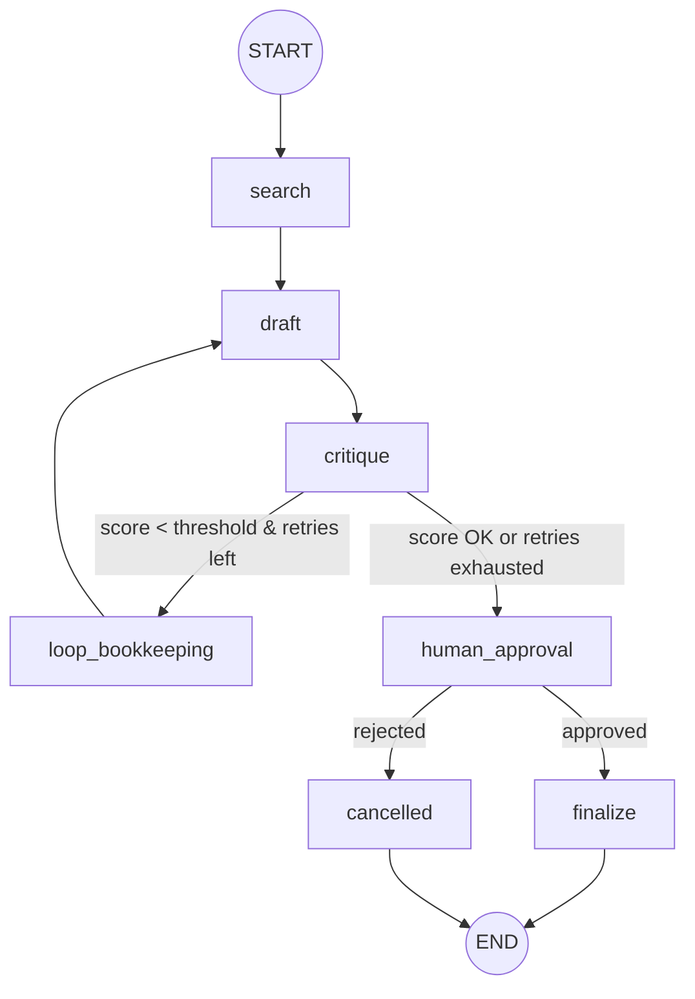

# Write-up — Week 2 / Day 3: LangGraph

## 1. Graph diagram

```
START
  |
  v
search  (looks up both products in the catalog)
  |
  v
draft  (LLM writes a recommendation) <----------------+
  |                                                    |
  v                                                    |
critique  (LLM scores the draft 1-10)                  |
  |                                                     |
  +--- score < threshold AND retries left ---> loop_bookkeeping
  |                                             (retries += 1)
  |
  +--- score OK, or retries exhausted --------> human_approval
                                                     |
                                    +----------------+----------------+
                                    |                                 |
                                approved                          rejected
                                    |                                 |
                                    v                                 v
                                finalize                          cancelled
                                    |                                 |
                                    v                                 v
                                   END                               END
```

Mermaid version (renders on GitHub):



## 2. State design

A single `TypedDict` (`lg_state.py`) tracks the question, both product
names, raw catalog data, the current draft, the latest critique feedback
and score, a `retries` counter capped by `max_retries`, the human's
`approved` decision, the `final_output`, and a `log` list. Every field
except `log` uses LangGraph's default overwrite-on-update behavior — each
node's return value replaces the old value with the latest one, which is
exactly what you want for a running counter or the current draft. `log`
is the one field annotated with the `operator.add` reducer, so every
node's log entries accumulate into one continuous trace instead of
replacing each other, letting the full run — including every pass through
the self-correction loop — be printed at the end from one place.

## 3. Why the self-correction loop is awkward in `AgentExecutor`, natural in LangGraph

`AgentExecutor`'s loop is entirely implicit and driven by the model's own
tool-call decisions turn by turn — there's no first-class "go back to step
X if condition Y" primitive. Expressing "redraft if the critique score is
below 7, but stop after 2 retries" would mean encoding that logic into a
system prompt and hoping the model tracks and respects its own retry
count, with no real enforcement. In LangGraph, the loop is just graph
structure: `critique` has a conditional edge, gated by an ordinary Python
function inspecting real state (`quality_score`, `retries`), that can
point backward to `draft`. This is the same explicit control Day 1's raw
`while` loop had, but composable with branches and multiple distinct
nodes rather than one flat sequence.

## 4. Human-in-the-loop

The `human_approval` node calls `interrupt(...)`, which raises a
resumable exception that pauses the graph and persists its state via the
checkpointer. Resuming requires a separate call passing
`Command(resume=...)` with the human's decision, which is then used to
route to either `finalize` (send to client) or `cancelled` (nothing
sent). This was demonstrated for both an approved and a rejected path on
separate threads.

**When a real product should require this:** gate on the cost of being
wrong, not on how important a task subjectively feels. Actions that are
hard to reverse, costly if wrong, or affect someone outside the system's
own sandbox — sending a message to a real client, making a purchase,
deleting data — deserve a human gate. Actions that are cheap, reversible,
and fully contained (looking something up, drafting text nobody has seen
yet, retrying a failed calculation) are reasonable to leave fully
autonomous; adding a human gate there mostly just adds friction without
reducing real risk.

## 5. Persistence & debugging

An `InMemorySaver` checkpointer, keyed by `thread_id`, lets the graph's
state survive across two entirely separate `.invoke()` calls: one that
runs up to the interrupt, and a second (potentially in a different
process/session) that resumes with `Command(resume=...)` and still has
full access to everything computed before the pause. `graph.get_state(config)`
inspects the current persisted snapshot, and `graph.get_state_history(config)`
walks every checkpoint recorded for that thread — each one independently
replayable by passing its `checkpoint_id` back into the config, which is
how you'd time-travel to the exact point a bad draft was produced during
the self-correction loop and debug from there, rather than re-running the
whole graph from scratch.

## 6. `AgentExecutor` vs. LangGraph — when to reach for each

`AgentExecutor` is the right tool for a single bounded exchange where the
model itself should decide, turn by turn, which tool to call next — Day
2's product-comparison agent is a good fit, and needed far less code than
an equivalent LangGraph workflow would. LangGraph earns its extra
complexity once the workflow has real structure the developer wants to
*guarantee* rather than leave entirely to the model's discretion: explicit
self-correction loops with hard retry caps, mandatory human-approval
gates before risky actions, several distinct stages that each need their
own prompt or tools, or a need to pause, persist, and resume a run across
completely separate sessions — none of which a single `AgentExecutor`
loop has a clean primitive for.
